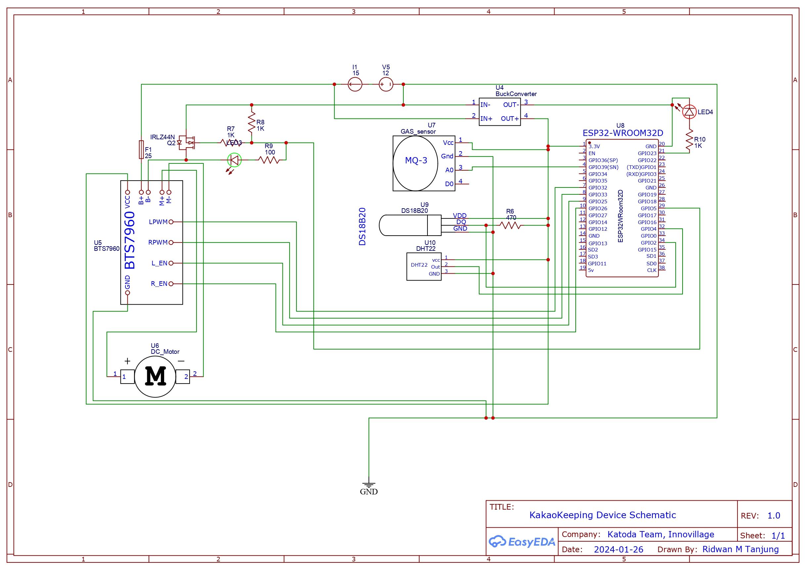

# CacaoKeeping

CacaoKeeping is an ESP-32 firmware for real-time and accurate IoT-based monitoring of temperature, pH and alcohol production in cacao fermentation.

## Development Environment

CacaoKeeping uses the platformIO framework for Visual Studio Code. Please refer to the [PlatformIO documentation](https://docs.platformio.org/en/latest/) for more information

## Wiring diagram

Below is a schematic diagram for integrating sensors and actuators into a microcontroller. For further information regarding sensor & actuator specifications, please refer to its respective datasheets

## Contributing

Pull requests are welcome. For major changes, please open an issue first
to discuss what you would like to change.

Please make sure to update tests as appropriate.

## License

[MIT](https://choosealicense.com/licenses/mit/)
